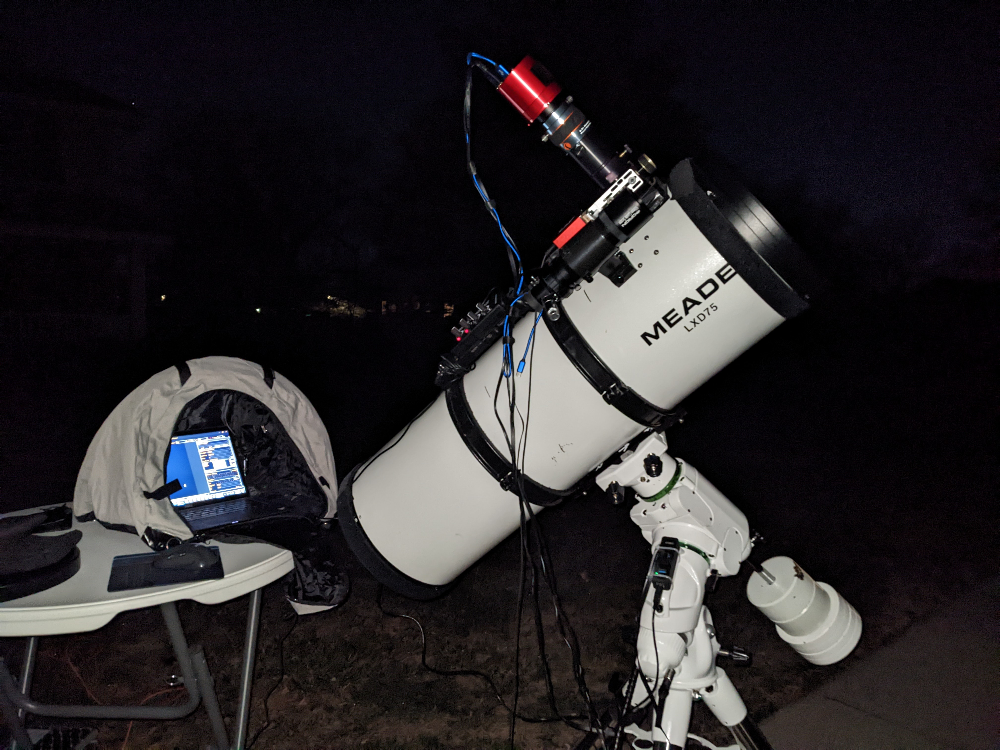

# Welcome to telescope.pics

Welcome to telescope.pics!  The purpose of this website is to share the results of my lifelong interest in astrophotography! I've been interested in astronomy since my teen years, and spent decades juggling an engineering career with skywatching. In 1996, when Comet Hyakatuki splashed across the sky, I turned my SLR camera upward and never looked back! Transitioning out of film in the early 2000's, I continued over the years to try to improve my ability to photograph celestial events. 

I have viewed many websites and blogs, and have learned from each one of them. I am not the best at this hobby (there are many fine artists and astronomers who do better) but what sucess I've had I am willing to share with the local community. In addition, I use this hobby in education and public outreach to teach basic astronomy to children and adults of all ages.

I will also share technical detail on how I do things and take pictures, and am always open for suggestions and comments on doing better. 

Soon, we will add a section to leave comments and address questions. In the mean time, enjoy the site.

I wish to acknowledge my spouse Linda, my brother William, and my son Stephen for helping me pursue this hobby and build this site.

Brian M. Kent, Ph.D.
Dayton, Ohio USA

# Coming Soon: Ability to leave comments and ask questions.

